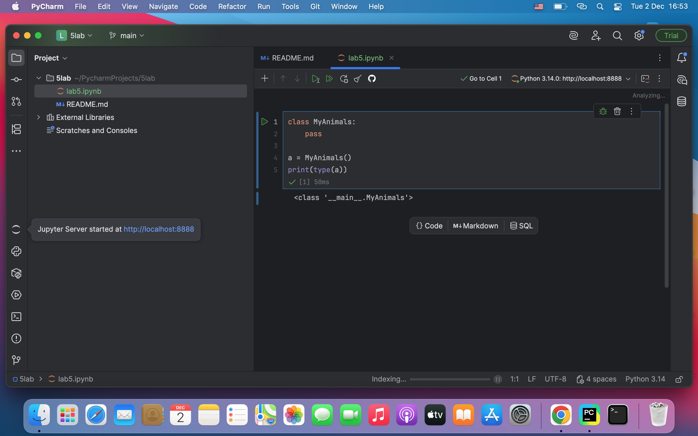
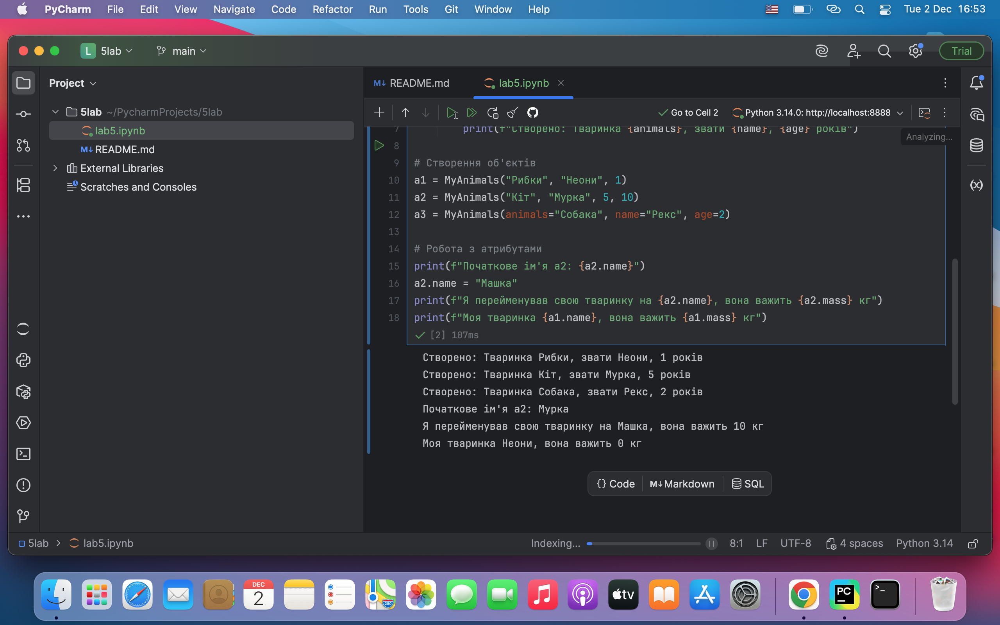
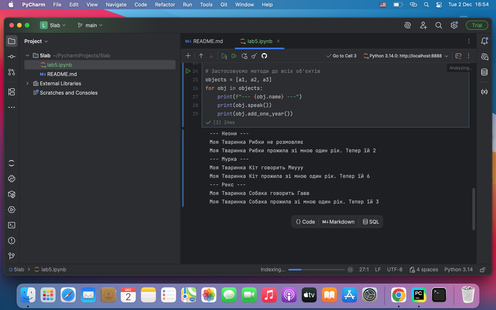
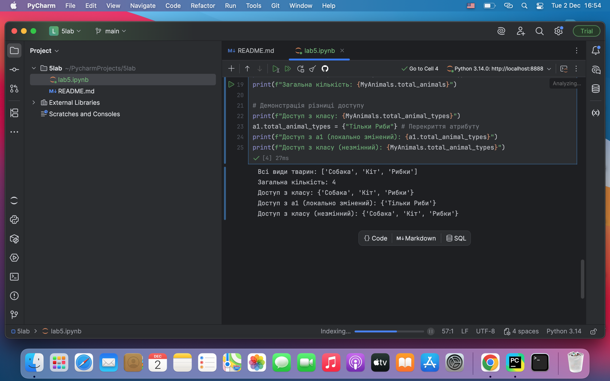
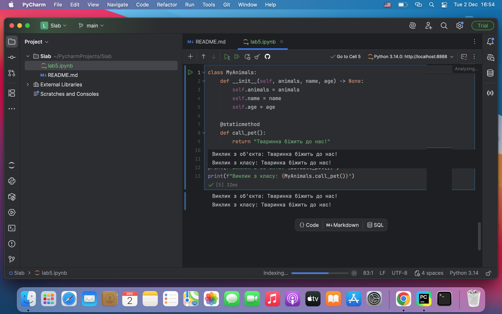
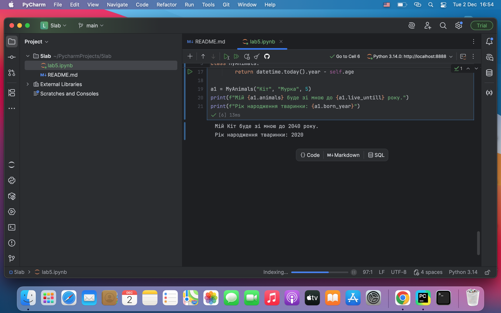
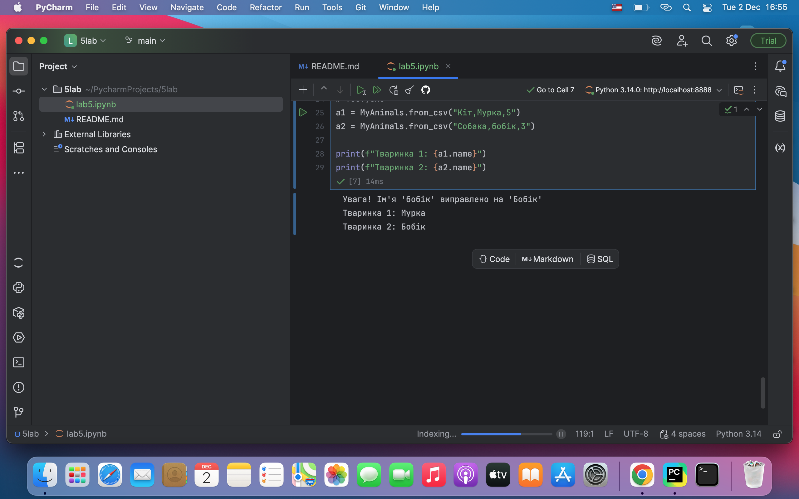
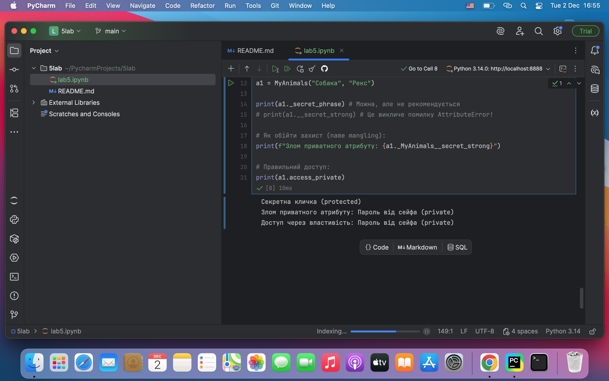
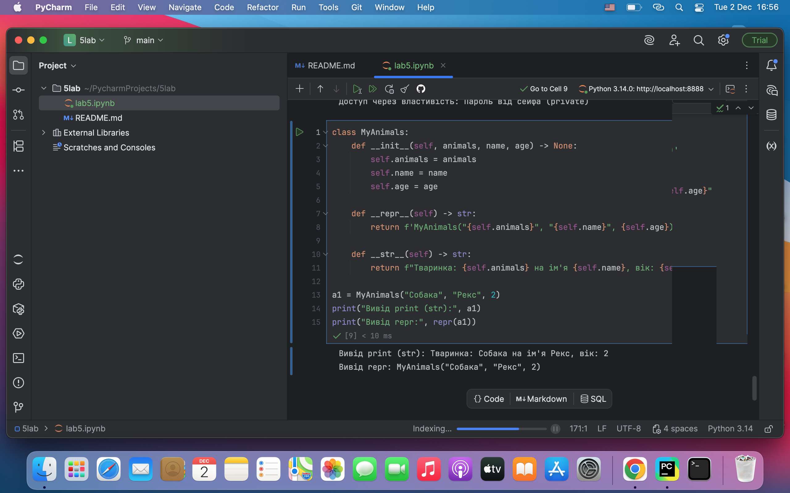
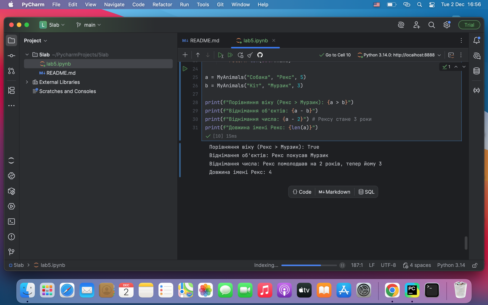

# Звіт з лабораторної роботи: Основи Об'єктно-Орієнтованого Програмування (ООП) в Python

## Мета роботи
Ознайомлення з **основними концепціями Об'єктно-Орієнтованого Програмування** (ООП) в мові Python, включаючи створення класів, використання **конструктора**, **методів**, **властивостей** (`@property`), **змінних класу** та **магічних методів**.

---

## Хід роботи та Результати

### 1. Створення базового класу
**Завдання:** Створити порожній клас `MyAnimals` та вивести **тип** створеного об'єкта.

class MyAnimals:
    pass

a = MyAnimals()
print(type(a))

2. Конструктор (__init__) та Атрибути Об'єкта
Завдання: Створити конструктор, ініціалізувати об'єкти з різними параметрами та продемонструвати зміну атрибутів об'єкта.

Python

class MyAnimals:
    def __init__(self, animals, name, age, mass=None) -> None:
        self.animals = animals
        self.name = name
        self.age = age
        self.mass = 0 if mass is None else mass

a1 = MyAnimals("Рибки", "Неони", 1)
a2 = MyAnimals("Кіт", "Мурка", 5, 10)

print(f"Початкове ім'я a2: {a2.name}")
a2.name = "Машка"
print(f"Я перейменував свою тваринку на {a2.name}")

3. Методи Класу (Поведінка Об'єктів)
Завдання: Додати методи speak() та add_one_year() та застосувати їх до об'єктів.

Python

class MyAnimals:
    # ... __init__ ...
    
    def speak(self):
        if self.animals == "Кіт":
            return f"Моя Тваринка {self.animals} говорить **Мяууу**"
        # ...
    
    def add_one_year(self):
        self.age += 1
        return f"Моя Тваринка {self.animals} прожила один рік. Тепер їй **{self.age}**"

a2 = MyAnimals("Кіт", "Мурка", 5)

print(a2.speak())
print(a2.add_one_year())

4. Змінні Класу (Глобальні Змінні)
Завдання: Використовувати змінні класу (total_animals, total_animal_types) для обліку всіх створених об'єктів.

Python

class MyAnimals:
    total_animals = 0
    total_animal_types = set()

    def __init__(self, animals, name, age) -> None:
        # ...
        MyAnimals.total_animal_types.add(animals)
        MyAnimals.total_animals += 1

a1 = MyAnimals("Рибки", "Неони", 1)
MyAnimals("Кіт", "Мурка", 5)

print(f"Загальна кількість: **{MyAnimals.total_animals}**")
print(f"Всі види тварин: {list(MyAnimals.total_animal_types)}")

5. Статичні методи (@staticmethod)
Завдання: Додати статичний метод call_pet(), який не залежить від стану конкретного об'єкта.

Python

class MyAnimals:
    # ... __init__ ...
    
    @staticmethod
    def call_pet():
        return "**Тваринка біжить до нас!**"

a1 = MyAnimals("Рибки", "Гупії", 1)

print(f"Виклик з об'єкта: {a1.call_pet()}")
print(f"Виклик з класу: {MyAnimals.call_pet()}")

6. Робота з Properties (@property)
Завдання: Додати властивість, що динамічно обчислюється, наприклад, born_year (рік народження).

Python

from datetime import datetime

class MyAnimals:
    # ... __init__ ...
    
    @property
    def born_year(self):
        # Обчислює рік, коли тваринка народилася
        return datetime.today().year - self.age

a1 = MyAnimals("Кіт", "Мурка", 5)

print(f"Рік народження: **{a1.born_year}**")

7. Методи Класу (@classmethod) та Валідація
Завдання: Додати метод класу from_csv та валідацію імені (перевірка великої літери).

Python

class MyAnimals:
    # ... __init__ та інше ...

    @classmethod
    def from_csv(cls, csv_data: str):
        animal, name, age = csv_data.split(",")
        
        # Валідація: якщо ім'я з малої, виправляємо
        if not name[0].isupper():
            print(f"Виправлення: '{name}' на '{name.capitalize()}'")
            name = name.capitalize()
            
        return cls(animal, name, int(age))

a2 = MyAnimals.from_csv("Собака,бобік,3")

print(f"Ім'я після валідації: **{a2.name}**")

8. Приватні Атрибути та Методи (Інкапсуляція)
Завдання: Продемонструвати захищені (_) та суворо приватні (__) атрибути та правильний доступ до них через property.

Python

class MyAnimals:
    def __init__(self, animals, name) -> None:
        self._secret_phrase = "Секретна кличка (захищений)"
        self.__secret_strong = "Пароль (приватний)"
    
    @property
    def access_private(self):
        return f"Доступ через властивість: {self.__secret_strong}"

a1 = MyAnimals("Собака", "Рекс")

print(a1.access_private)

9. Магічні Методи (__str__ та __repr__)
Завдання: Реалізувати магічні методи для друку об'єкта (__str__) та його представлення для розробника (__repr__).

Python

class MyAnimals:
    def __init__(self, animals, name, age) -> None:
        self.animals = animals
        self.name = name
        self.age = age

    def __repr__(self) -> str:
        return f'MyAnimals("{self.animals}", "{self.name}", {self.age})'

    def __str__(self) -> str:
        return f"Тваринка: {self.animals} на ім'я **{self.name}**, вік: {self.age}"

a1 = MyAnimals("Собака", "Рекс", 2)

print("Вивід print (__str__):", a1)
print("Вивід repr():", repr(a1))

10. Арифметичні Магічні Методи
Завдання: Перевантажити оператори віднімання (__sub__), порівняння (__gt__) та довжини (__len__).

Python

class MyAnimals:
    # ... __init__ ...

    def __sub__(self, obj):
        if isinstance(obj, MyAnimals):
            return f"**{self.name} покусав {obj.name}**"
        # ...
    
    def __gt__(self, obj):
        if isinstance(obj, MyAnimals):
            return self.age > obj.age

    def __len__(self) -> int:
        return len(self.name)
            
a = MyAnimals("Собака", "Рекс", 5)
b = MyAnimals("Кіт", "Мурзик", 3)

print(f"Порівняння віку (Рекс > Мурзик): **{a > b}**")
print(f"Віднімання об'єктів: {a - b}")
print(f"Довжина імені: {len(a)}")

Висновок
Під час виконання лабораторної роботи були успішно засвоєні ключові принципи ООП в Python: Інкапсуляція, використання змінних класу, динамічних властивостей та механізмів перевантаження операторів. Усі поставлені завдання були виконані.